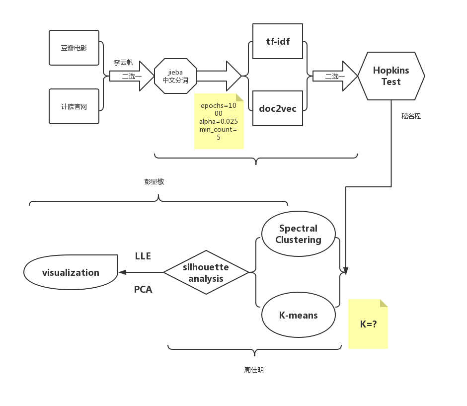

# Document-Clustering-Based-on-Spectral-Clustering
- **spider.py** : basic spider based on bs4, acquiring input data
- **segmenter.py** : chinese word segmenting, document encoding by tf-idf or doc2vec
- **hopkins.py** : hopkins test
- **dr.py** + **k-means.py** : spectral clustering & visualization
- 
